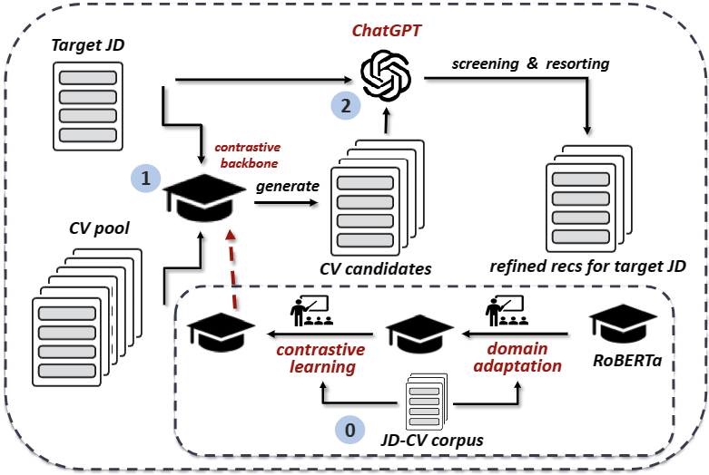

# A ChatGPT Enhanced Two-stage Framework for Person-Job Fit in Talent Recruitment
This is the relevant code repository for reproducing the models and pipeline described in *A ChatGPT Enhanced Two-stage Framework for Person-Job Fit in Talent Recruitment*.

## Framework
As described in the paper, our framework comprises two stages. In the first-stage, we generate primary curriculum vitae (CV) candidates $C_i=\left\{\text{CV}_{i_j}\right\}_{j=1}^{k}$ for the given target job description $\text{JD}_i$ through the contrastive backbone $M_\text{CL}$. Subsequently, in the second stage, we utilize [ChatGPT](https://openai.com/chatgpt) to analyze and sort $C_i$ to provide a better CV recommendations for $\text{JD}_i$. The contrastive backbone $M_\text{CL}$ is built from Domain Adaptation (DA) and Contrastive Learning (CL). The following figure illustrates  the framework clearly. More details are available in the paper.

<p align="center">
    <br>
    <!--  -->
    
      <figcaption style="text-align: center;"> Figure 1: The framework of our method. </figcaption>
    <br>
</p>


## Code Explanation

### Structure

| Project Directory |
| -------------- |
| run_da.py |
| run_cl.py |
| run_stage_1.py |
| run_stage_2.py |
| mlm_utils.py |
| utils.py |
| requirements.txt |

`run_da.py` and `run_cl.py` are two training programs for domain adaptation and contrastive learning respectively (\# 0 in Fig. [1](#framework)). After sequential execution, we can obtain the contrastive backbone $M_\text{CL}$.

`run_stage_1.py` and `run_stage_2.py` are two programs for *Candidate Generation* (\# 1 in Fig. [1](#framework)) and *LLM-based Recommendation* ((\# 2 in Fig. [1](#framework).)) respectively.

`mlm_utils.py` and `utils.py` contain some utility functions useful in training.


### Install Dependencies
```bash
conda create -n llm2rec python=3.8
conda activate llm2rec
pip install -r requirements.txt 
```

### Fine-tuning

#### Data Format

The input data should be in the following format:
$$
[[\text{text}_\text{CV}^{(1)}, \text{text}_\text{JD}^{(1)}, \text{state}^{(1)}], [\text{text}_\text{CV}^{(2)}, \text{text}_\text{JD}^{(2)}, \text{state}^{(2)}], \dots]
$$
Actually the $\text{state}$ is only useful for data preprocessing. It does not matter if it's missing. Just make sure there is no error when reading the data for training.

#### CMD

run domain adaptation:
```bash
python run_da.py --model_name mlm_da \
                 --data_path your_data_path \ 
                 --epochs 2 \
                 --lr 1e-5 \
                 --gpu_id 0
```

run contrastive learning:
```bash
python run_cl.py --model_name cl_backbone \
                 --data_path your_data_path \ 
                 --epochs num_epochs \
                 --lr 1e-5 \
                 --gpu_id 0 \
                 --mlm_epoch 2 \
                 --max_length 512 \
                 --batch_size 48 \
                 --model_size base \
```

## Prompt

For better readability, we present one prompt example we used for ChatGPT in the following:


```
You are a professional HR who can determine whether a job description and a curriculum vitae match and provide comments.

You are provided with inputs in the following format:
"""
job description:
a paragraph of text

curriculum vitae:
a paragraph of text
"""

Your task is to output the following:
1. An overall matching score between the curriculum vitae and the job description (0-100).
2. A matching score between the educational background in the curriculum vitae and the job description (0-100).
3. A matching score between the work experience in the curriculum vitae and the job description (0-100).
4. A matching score between the professional skills in the curriculum vitae and the job description (0-100).

The results should be represented in a JSON format with the following key-value pairs:
{
    "overall": a number between 0 and 100,
    "education": a number between 0 and 100,
    "education comment": a detailed paragraph of comment on the education score
    "experience": a number between 0 and 100,
    "experience comment": a detailed paragraph of comment on the experience score
    "skill": a number between 0 and 100,
    "skill comment": a detailed paragraph of comment on the skill score
}

You should pay attention to the content of "work experience", "job description", and "job requirements" in the job description during the matching process. You also need to pay attention to the content of "work experience", "educational background", and "work experience" in the curriculum vitae.
The basis for matching should be dynamically generated based on the input job description and curriculum vitae content.
You should provide any other information or feedback about the matching process and automatically handle any errors or missing information that may exist in the curriculum vitae. If there are errors, you should skip the missing information and continue to complete the matching.
Your first response should be 'Understood.'.
```


## Ensemble

This section demonstrates how we obtain a final output from multiple prompts. 

Firstly, We construct multiple prompts for a given JD-CV pair and input them into ChatGPT to obtain corresponding multiple outputs. (Fig. [2](#prompt-ensemble-1))

<figure>
  
  <figcaption style="text-align: center;"> Figure 2: The overview of analyses generation. </figcaption>
</figure>

\
\
Then, we aggregate these outputs in the manner shown in Fig. [3](#prompt-ensemble-2).

<figure>
  
  <figcaption style="text-align: center;"> Figure 3: The details of prompt ensemble. </figcaption>
</figure>

\
\
There are two options for the calculation, one is the arithmetic mean over all the total scores, and the other is the arithmetic mean over the weighted means. For the weight mean $\sum^{l} w_ls_l^{(i)}$ mentioned in Fig. [3](#prompt-ensemble-2), $s_l^{(i)}$ is the sub-score of the $l$-th criterion of the $i$-th analysis. $w_l$ is the related weight of $s_l^{(i)}$ and is determined by the system user. We choose the first calculation in our work. However, it is easy to convert to the second calculation for more customized demands. On the other hand, in order to derive a final analysis from all the generated analyses from diverse prompts, We utilize ChatGPT again to summarize these analyses through a well-designed prompt template to obtain the final comprehensive analysis. Specifically, each criterion has a corresponding sub-score and comment in each output. Thus, for any criterion, it contains $n$ sub-scores and comments in total. We take the arithmetic mean of the sub-scores as the final sub-score. The comments are analyzed by ChatGPT and their commonalities are summarized as the final comment on the criterion.
